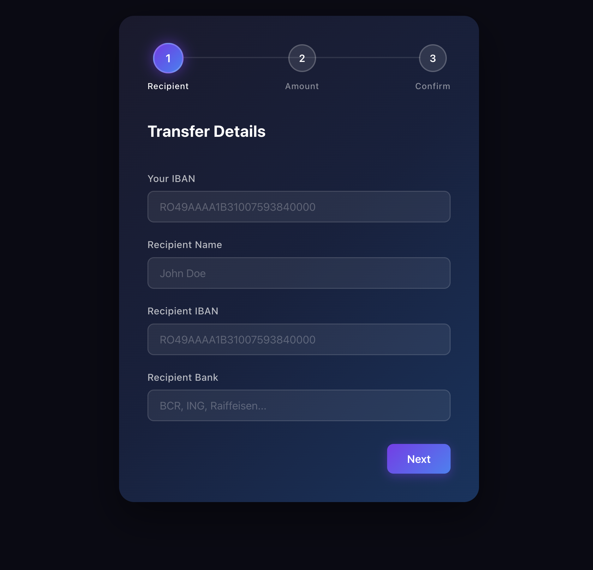

# 💸 Bank Transfer App

A React + TypeScript multi-step bank transfer form built with validation.

## Preview



## Tech Stack

- [React 18](https://react.dev/)
- [TypeScript](https://www.typescriptlang.org/)
- [Vite](https://vitejs.dev/)
- [SASS / SCSS](https://sass-lang.com/)

## Features

- 3-step form flow: **Recipient → Amount → Confirm**
- Validation with `useState` — no external validation libraries
- IBAN format validation with regex
- Prevents transfers to the same IBAN
- Per-field error messages that clear as the user types
- Step-by-step validation — only validates fields in the current step
- Transfer summary on the confirm step
- Success screen after submission
- Fully responsive, centered layout
- Neo-banking dark gradient UI with SCSS BEM

## Project Structure

```
src/
├── components/
│   └── TransferForm/
│       ├── TransferForm.tsx       # Main form component — handles state, validation, navigation
│       ├── TransferForm.scss      # All styles using BEM methodology
│       └── steps/
│           ├── StepRecipient.tsx  # Step 1: from IBAN, recipient name, to IBAN, bank
│           ├── StepAmount.tsx     # Step 2: amount, currency, description
│           └── StepConfirm.tsx    # Step 3: summary + agree checkbox
├── types/
│   └── index.ts                # TransferFormData and FormErrors interfaces
├── utils/
│   └── validate.ts                # Validation functions per step
├── App.tsx
├── App.scss
└── main.tsx
```

## Form Steps

### Step 1 — Recipient Details

- **Your IBAN** — validated against IBAN regex format
- **Recipient Name** — minimum 3 characters
- **Recipient IBAN** — validated format, cannot match your own IBAN
- **Recipient Bank** — required field

### Step 2 — Transfer Amount

- **Amount** — number between 1 and 50,000
- **Currency** — RON, EUR, or USD
- **Description** — optional

### Step 3 — Confirm

- Full transfer summary displayed
- Checkbox confirmation required before submitting

## Getting Started

### Prerequisites

- Node.js 18+
- npm

### Installation and run in development

```bash
npm install
npm run dev
```

Open [http://localhost:5173](http://localhost:5173) in your browser.

### Build for production

```bash
npm run build
```

## How Validation Works

Validation is done with `useState` — no external libraries

Each step has its own validation function in `src/utils/validate.ts`:

```typescript
export function validateStep1(data: TransferFormData): FormErrors {
  const errors: FormErrors = {};

  if (!data.fromIban.trim()) {
    errors.fromIban = "Your IBAN is required";
  } else if (!ibanRegex.test(data.fromIban.trim())) {
    errors.fromIban = "Invalid IBAN format";
  }

  // ...more validations

  return errors;
}
```

When the user clicks **Next**, only the fields in the current step are validated. Errors are cleared field by field as the user types.

## SCSS BEM Structure

All styles follow the BEM (Block Element Modifier) methodology:

```scss
.transfer-form {
} // Block
.transfer-form__field {
} // Element
.transfer-form__input {
} // Element
.transfer-form__input--error {
} // Modifier
.transfer-form__btn--next {
} // Modifier
```
