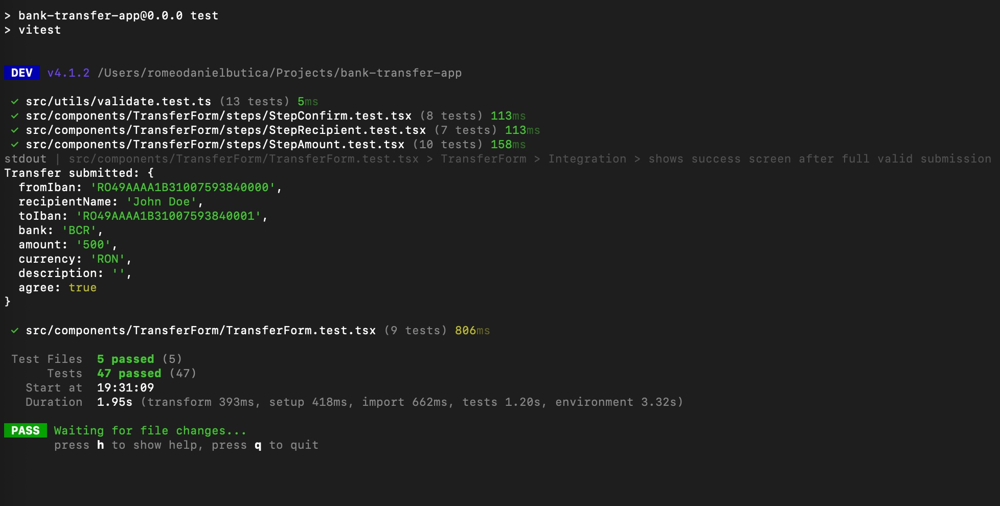

# 💸 Bank Transfer App

A React + TypeScript multi-step bank transfer form built with validation.

## Preview


## Tech Stack

- [React 18](https://react.dev/)
- [TypeScript](https://www.typescriptlang.org/)
- [Vite](https://vitejs.dev/)
- [SASS / SCSS](https://sass-lang.com/)
- [Vitest](https://vitest.dev/)
- [React Testing Library](https://testing-library.com/)

## Features

- 3-step form flow: **Recipient → Amount → Confirm**
- Validation for form
- IBAN format validation with regex
- Prevents transfers to the same IBAN
- Per-field error messages that clear as the user types
- Step-by-step validation — only validates fields in the current step
- Transfer summary on the confirm step
- Success screen after submission
- Fully responsive, centered layout
- Neo-banking dark gradient UI with SCSS BEM

## Project Structure

```
src/
├── components/
│   └── TransferForm/
│       ├── TransferForm.tsx           # Main form component — handles state, validation, navigation
│       ├── TransferForm.scss          # All styles using BEM methodology
│       ├── TransferForm.test.tsx      # Unit + integration tests
│       └── steps/
│           ├── StepRecipient.tsx      # Step 1: from IBAN, recipient name, to IBAN, bank
│           ├── StepRecipient.test.tsx
│           ├── StepAmount.tsx         # Step 2: amount, currency, description
│           ├── StepAmount.test.tsx
│           ├── StepConfirm.tsx        # Step 3: summary + agree checkbox
│           └── StepConfirm.test.tsx
├── types/
│   └── transfer.ts                    # TransferFormData and FormErrors interfaces
├── utils/
│   ├── validate.ts                    # Validation functions per step
│   └── validate.test.ts
├── App.tsx
├── App.scss
└── main.tsx
```

## Form Steps

### Step 1 — Recipient Details

- **Your IBAN** — validated against IBAN regex format
- **Recipient Name** — minimum 3 characters
- **Recipient IBAN** — validated format, cannot match your own IBAN
- **Recipient Bank** — required field

### Step 2 — Transfer Amount

- **Amount** — number between 1 and 50,000
- **Currency** — RON, EUR, or USD
- **Description** — optional

### Step 3 — Confirm

- Full transfer summary displayed
- Checkbox confirmation required before submitting

## Getting Started

### Prerequisites

- Node.js 18+
- npm

### Installation & run in development

```bash
npm install
npm run dev
```

## Tests



**47 tests across 5 test files — all passing.**

Tests are written with Vitest + React Testing Library and are split into:

- **Unit tests** — isolated component rendering, props, error display
- **Integration tests** — full user flows, navigation between steps, form submission

### Run tests

```bash
npm run test
```

### Test files

| File                     | Tests |
| ------------------------ | ----- |
| `utils/validate.test.ts` | 13    |
| `TransferForm.test.tsx`  | 9     |
| `StepRecipient.test.tsx` | 7     |
| `StepAmount.test.tsx`    | 10    |
| `StepConfirm.test.tsx`   | 8     |

## How Validation Works

Each step has its own validation function in `src/utils/validate.ts`:

```typescript
export function validateStep1(data: TransferFormData): FormErrors {
  const errors: FormErrors = {};

  if (!data.fromIban.trim()) {
    errors.fromIban = "Your IBAN is required";
  } else if (!ibanRegex.test(data.fromIban.trim())) {
    errors.fromIban = "Invalid IBAN format";
  }

  // ...more validations

  return errors;
}
```

When the user clicks **Next**, only the fields in the current step are validated. Errors are cleared field by field as the user types.

## SCSS BEM Structure

All styles follow the BEM (Block Element Modifier) methodology:

**Final classes:**

```scss
.transfer-form {
} /* Block */
.transfer-form__field {
} /* Element */
.transfer-form__input {
} /* Element */
.transfer-form__input--error {
} /* Modifier */
.transfer-form__btn--next {
} /* Modifier */
```

**SCSS nesting:**

```scss
.transfer-form {
  &__field {
  }

  &__input {
    &--error {
    }
  }

  &__btn {
    &--next {
    }
    &--back {
    }
    &--submit {
    }
  }
}
```
